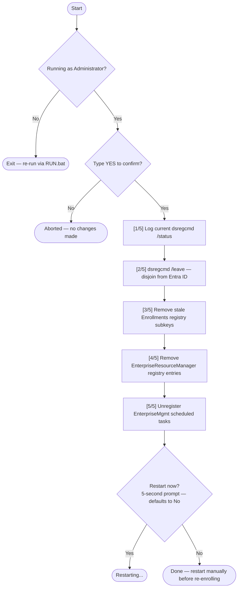

# Reset-EntraEnrollment

<!-- BADGES:START -->
[](LICENSE) [](https://learn.microsoft.com/en-us/powershell/) [](https://www.microsoft.com/windows) [](https://github.com/5a9awneh/Reset-EntraEnrollment/commits/master) [](https://github.com/5a9awneh/Reset-EntraEnrollment)
<!-- BADGES:END -->

Removes stale Entra ID / Azure AD enrollment artifacts from a Windows device. Useful when a device shows as enrolled but re-enrollment fails, or when decommissioning a device that needs to be re-provisioned.

**`dsregcmd /status` — stale enrollment *(representative)* — device appears joined but re-enrollment fails:**

```
+----------------------------------------------------------------------+
| Device State                                                         |
+----------------------------------------------------------------------+

             AzureAdJoined : YES
          EnterpriseJoined : NO
              DomainJoined : NO

+----------------------------------------------------------------------+
| User State                                                           |
+----------------------------------------------------------------------+

       WorkplaceJoined : YES
         WamDefaultSet : NO
```



---

## ⚙️ Requirements

- Windows 10 / 11
- PowerShell 5.1 (built-in)
- Administrator rights (handled by `RUN.bat`)

---

## 🚀 Usage

1. Copy the folder to the device (e.g. a USB drive or network share)
2. Double-click **`RUN.bat`** — it will prompt for UAC elevation automatically
3. Read the warning, type **`YES`** and press Enter to proceed
4. When prompted, press **Y** within 5 seconds to restart immediately (defaults to No)
5. After restart, re-enroll via **Settings › Accounts › Access work or school › Connect**

> A timestamped log file (`EntraCleanup_*.log`) is saved in the same folder as the script.

---

## 🔧 How It Works

The script runs five steps in sequence:

| Step | Action |
|------|--------|
| 1 | Runs `dsregcmd /status` and logs the current enrollment state |
| 2 | Runs `dsregcmd /leave` to disjoin the device from Entra ID / Azure AD |
| 3 | Removes stale enrollment subkeys under `HKLM:\SOFTWARE\Microsoft\Enrollments` (preserving system keys) |
| 4 | Removes tracked entries under `HKLM:\SOFTWARE\Microsoft\EnterpriseResourceManager\Tracked` |
| 5 | Unregisters all scheduled tasks under the `EnterpriseMgmt` task path |

After completion, the script prompts to restart immediately (defaults to **No** after 5 seconds).

---

## ⚠️ Warnings & Limitations

- **Irreversible without re-enrollment** — all Entra ID / MDM enrollment data is removed. The device will need to be re-enrolled before managed policies and resources (e.g. conditional access, Intune apps) are restored.
- **Does not remove the device object from Entra ID** — the device record in the portal must be deleted separately via the Entra admin centre or Intune.
- **Does not affect local accounts** — only the work/school account enrollment is removed; local user profiles are untouched.
- **Requires an active internet connection to re-enroll** — ensure network access is available before rejoining.
